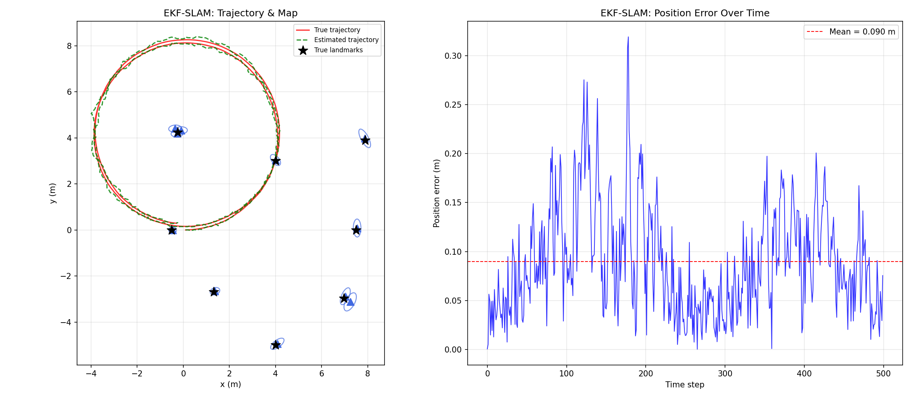
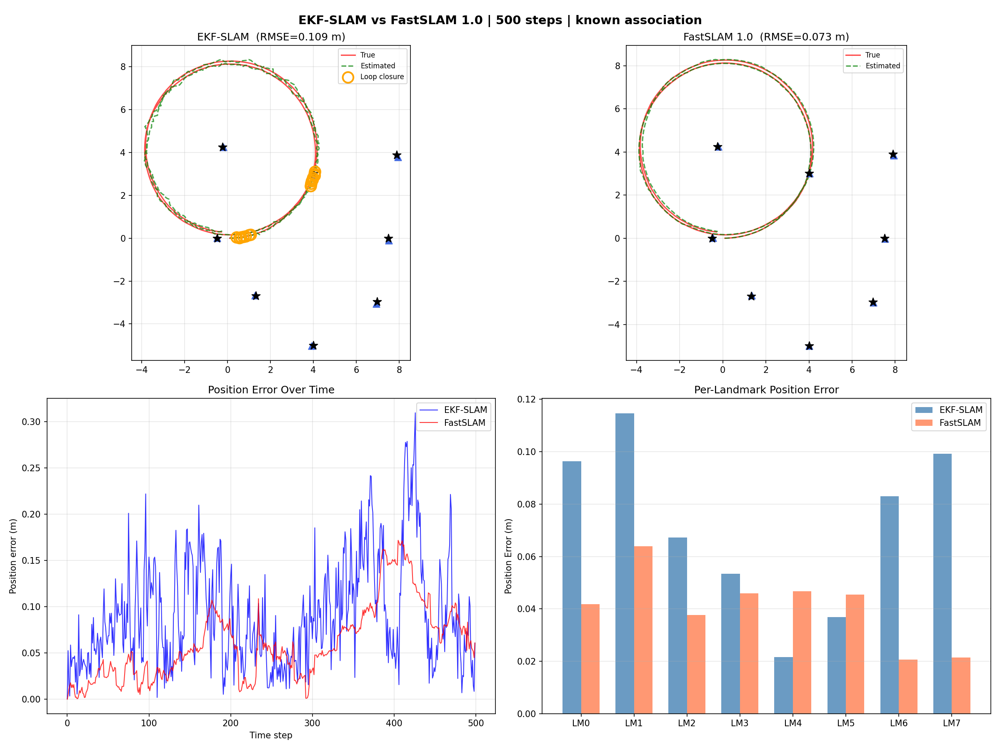
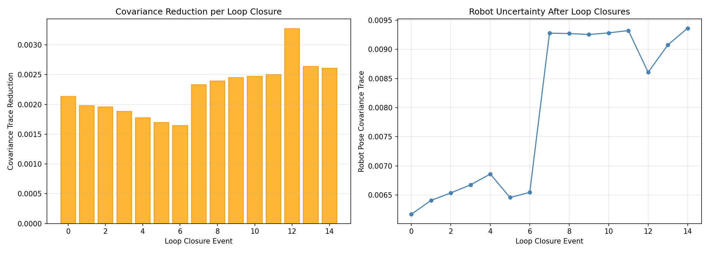

# EKF-SLAM & FastSLAM 1.0 from Scratch

Two SLAM algorithms implemented from scratch in pure Python/NumPy — no robotics framework required. Intended as a clear, self-contained reference for the math behind each approach.

---

## Quick start

```bash
pip install -r requirements.txt   # numpy, matplotlib, Pillow, scipy

python main.py                     # EKF-SLAM, real-time GUI, known association
python main.py --unknown-association   # ML data association (no landmark IDs)
python main.py --no-gui --seed 42  # headless, fixed seed

python compare.py                  # EKF-SLAM vs FastSLAM side-by-side
```

---

## Results

Both algorithms run on the same simulated scenario: a robot driving a 4 m-radius circle for 500 steps (~2 full laps), observing 8 landmarks with noisy range-bearing sensors. Noise draws are identical so results are directly comparable.

### EKF-SLAM — trajectory and landmark map



Left panel: true trajectory (red) vs. EKF estimate (green dashed), ground-truth landmarks (★) vs. estimated positions (▲) with 2σ uncertainty ellipses.
Right panel: per-step position error. The two spikes correspond to stretches where the robot briefly exits sensor range of most landmarks; error is corrected on the next loop.

### EKF-SLAM animated


### EKF-SLAM vs FastSLAM 1.0 — side-by-side comparison



Top row: trajectory + landmark maps. Bottom-left: position error over time. Bottom-right: per-landmark error (EKF blue, FastSLAM orange).

```
=================================================================
  COMPARISON: EKF-SLAM  vs  FastSLAM 1.0   (seed=42, 500 steps)
=================================================================
  Metric                              EKF-SLAM      FastSLAM
-----------------------------------------------------------------
  Trajectory RMSE (m)                   0.109         0.073
  Landmark RMSE (m)                     0.078         0.043
  Landmark mean error (m)               0.072         0.040
  Runtime (s)                           0.108         3.510
  Landmarks discovered                      8             8
  Loop closures detected                   15             0
=================================================================
```

FastSLAM achieves lower error because it samples robot poses directly from the motion model, avoiding EKF's linearisation bias around heading. The cost is a ~32× increase in runtime for 50 particles.

The landmark RMSE of 0.04–0.08 m is consistent with the theoretical noise floor: at a typical range of ~4 m, bearing noise of 2° ≈ 0.035 rad induces ~0.14 m lateral uncertainty per observation, which averages down over many revisits.

### Loop closure events (EKF-SLAM)



Each bar is one detected loop closure — a revisit that caused a >20% drop in robot pose covariance trace. The right panel shows how positional uncertainty decreases as closures accumulate across laps.

---

## What this implements

### EKF-SLAM (`ekf_slam.py`)

Maintains a single joint Gaussian over the full state:

$$\mu = \begin{bmatrix} x & y & \theta & l_{x_0} & l_{y_0} & \cdots & l_{x_{N-1}} & l_{y_{N-1}} \end{bmatrix}^\top \in \mathbb{R}^{3+2N}$$

The state vector grows dynamically — landmarks are appended on first observation, no pre-allocation.

**Predict.** Velocity motion model with sparse Jacobian propagation. Instead of materialising the full $n \times n$ Jacobian $F$, only the two non-trivial off-diagonal entries are applied, making the covariance propagation $O(n)$ rather than $O(n^2)$:

$$\Sigma' = F\Sigma F^\top + G R G^\top$$

$G$ injects process noise only into the robot pose rows, leaving landmark blocks unchanged.

**Associate.** Each observation is matched to the nearest landmark in Mahalanobis distance, gated by $\chi^2_{2,\,0.99} \approx 9.21$. In unknown-association mode, tentative observations are buffered in a candidate queue for ≥ 2 confirmations before a new landmark is committed — this suppresses ghost landmarks caused by noisy first observations through an uncertain pose. Stale candidates are pruned after 10 steps without re-observation.

**Update.** Joseph-form correction:

$$(I - KH)\,\Sigma\,(I - KH)^\top + K Q K^\top$$

Algebraically equivalent to the standard form but symmetrises the result at each step, preventing covariance matrices from losing positive-definiteness over long runs.

**Landmark initialisation.** On the very first observation of a landmark, covariance is set via the inverse observation Jacobian: $\Sigma_{lm} = H_{lm}^{-1} Q (H_{lm}^{-1})^\top$, rather than an arbitrary large diagonal.

**Loop closure.** Fires when an update simultaneously satisfies:
1. The landmark has ≥ 5 prior observations (well-mapped).
2. The robot pose trace was at or near its historical maximum (drift has accumulated).
3. The trace drops by > 20% in a single update (genuine uncertainty reduction).

This combination only triggers on genuine revisits after drift, not on routine corrections.

---

### FastSLAM 1.0 (`fastslam.py`)

Factorises the posterior using the Rao-Blackwell theorem. Each of $M$ particles holds:
- a robot pose sample $(x, y, \theta)$ drawn from the motion model
- $N$ independent per-landmark 2-D EKFs

Data association uses the same ML Mahalanobis strategy (with candidate buffer) as EKF-SLAM.

**Weights** are maintained in log space to prevent underflow/overflow across hundreds of steps:

$$\log w^{(m)} \mathrel{+}= \log\,\mathcal{N}\!\left(z_t;\;\hat{z}_t^{(m)},\; H\Sigma H^\top + Q\right)$$

Normalisation uses a log-sum-exp shift before exponentiation.

**Resampling.** Low-variance (systematic) resampling triggers when $N_\text{eff} = 1/\sum (w^{(m)})^2 < M/2$.

---

### Simulation (`simulation.py`)

- 8 landmarks at varying radii (3.0–6.0 m) around the circular path centre at $(4, 0)$.
- Motion noise: $\sigma_v = 0.05$ m/step, $\sigma_\omega = 1°$/step.
- Observation noise: $\sigma_r = 0.15$ m, $\sigma_\phi = 2°$.
- Sensor range cutoff: 8 m (robot always observes 2–5 landmarks per step).

Default command $v = 1.0$ m/s, $\omega = 0.25$ rad/s gives radius $R = 4$ m and period $T \approx 251$ steps. 500 steps ≈ two full laps, triggering genuine loop closures on each pass.

---

### Evaluation (`evaluation.py`)

- **Trajectory RMSE** — Euclidean position error averaged over all steps.
- **Heading RMSE** — angle-wrapped heading error.
- **Landmark RMSE** — position error per estimated landmark.
  - Known association: direct gt-id pairing.
  - Unknown association: optimal pairing via the Hungarian algorithm (`scipy.optimize.linear_sum_assignment`), with a 2 m ghost-landmark threshold.

---

## File structure

```
ekf_slam/
├── main.py          — EKF-SLAM entry point (argparse CLI, real-time GUI, GIF export)
├── compare.py       — runs both algorithms on identical noise, prints comparison table
├── ekf_slam.py      — EKFSLAM: predict / associate / update / loop closure
├── fastslam.py      — FastSLAM 1.0: particles, log-weights, systematic resampling
├── simulation.py    — ground-truth motion model and noisy range-bearing sensor
├── visualization.py — real-time matplotlib rendering, GIF export, static plots
├── evaluation.py    — trajectory RMSE, landmark error, Hungarian matching
├── utils.py         — wrap_angle utility
├── requirements.txt
└── LICENSE
```

---

## Usage

### EKF-SLAM

```bash
# Real-time GUI, known data association (landmark IDs given to filter)
python main.py

# ML data association — landmark IDs withheld; filter must associate on its own
python main.py --unknown-association

# Headless, fixed seed, save GIF
python main.py --no-gui --seed 42 --gif ekf_slam_output.gif

# Tighter circle (R = 2 m), longer run
python main.py --vel 1.0 --omega 0.5 --steps 800
```

### Comparison

```bash
# Default: 500 steps, 50 particles, seed 42
python compare.py

# More particles for better FastSLAM accuracy (slower)
python compare.py --particles 200 --seed 0

# Unknown association for both algorithms
python compare.py --unknown-association
```

### All options

| Flag | Default | Meaning |
|------|---------|---------|
| `--steps` | 500 | simulation steps |
| `--dt` | 0.1 | time step (s) |
| `--vel` | 1.0 | linear velocity (m/s) |
| `--omega` | 0.25 | angular velocity (rad/s); circle radius = vel / omega |
| `--max-range` | 8.0 | sensor range cutoff (m) |
| `--seed` | None | random seed for reproducibility |
| `--unknown-association` | off | ML data association — landmark IDs not provided |
| `--gate-threshold` | 9.21 | Mahalanobis² gate ($\chi^2_{2,\,0.99}$) |
| `--no-gui` | off | skip real-time window |
| `--gif` | `ekf_slam_output.gif` | animation output path (empty string to skip) |
| `--plot-dir` | `.` | directory for saved plots |
| `--particles` | 50 | FastSLAM particle count (`compare.py` only) |

---

## Design notes

**Sparse covariance propagation** — The full state Jacobian $F$ differs from identity in only two entries. Applying it naively is $O(n^2)$; the implementation exploits sparsity to update only the affected rows/columns of $\Sigma$ in $O(n)$.

**Joseph form** — The standard update $\Sigma' = (I-KH)\Sigma$ loses symmetry over many steps due to floating-point cancellation. The Joseph form $(I-KH)\Sigma(I-KH)^\top + KQK^\top$ symmetrises the result without extra computational cost.

**Candidate buffer** — A single noisy observation through an uncertain robot pose can place a ghost landmark a metre from the true position. Requiring two geometrically consistent observations (via Mahalanobis gating on candidate positions) before committing eliminates most ghost landmarks in unknown-association mode.

**Log-space weights** — With 3–5 observations per step over 500 steps, direct weight multiplication produces `inf` or `0.0` within a few hundred iterations. Log-space with a log-sum-exp normalisation prevents this at no precision cost.

**Why FastSLAM outperforms EKF-SLAM here** — The range-bearing observation model is nonlinear in robot heading. EKF-SLAM linearises around the current mean each step, accumulating a small bias. FastSLAM samples heading from the motion model, marginalising over pose uncertainty without linearisation. This advantage is proportional to heading noise — which is the dominant error source in this scenario.

---

## Dependencies

| Package | Version |
|---------|---------|
| numpy | ≥ 1.24 |
| matplotlib | ≥ 3.7 |
| Pillow | ≥ 10.0 |
| scipy | ≥ 1.11 |

Python 3.10+ required (`X | Y` union type hints).

---

## References

- Thrun, S., Burgard, W., Fox, D. (2005). *Probabilistic Robotics*. MIT Press.
- Montemerlo, M., Thrun, S., Koller, D., Wegbreit, B. (2002). FastSLAM: A Factored Solution to the Simultaneous Localization and Mapping Problem. *AAAI-02*.
- Dissanayake, G., et al. (2001). A solution to the simultaneous localisation and map building (SLAM) problem. *IEEE Transactions on Robotics and Automation*, 17(3), 229–241.

---

## License

[MIT](LICENSE)
