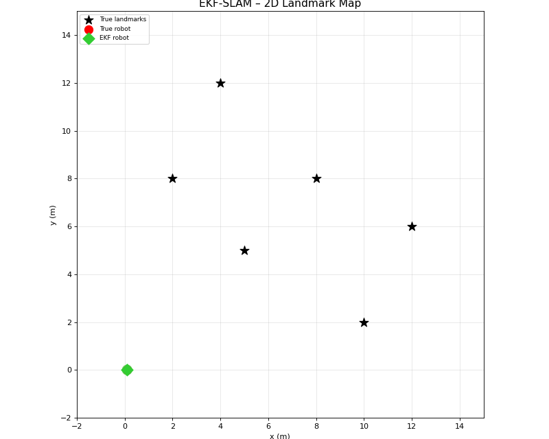

# EKF-SLAM from Scratch

A minimal, self-contained implementation of **Extended Kalman Filter SLAM** in Python, written to demonstrate the mathematical foundations of simultaneous localisation and mapping without relying on any robotics frameworks.



---

## Overview

This project implements the full-state EKF-SLAM algorithm for a 2-D differential-drive robot operating in an environment with point landmarks. The robot estimates its own pose and a map of landmark positions jointly, starting from a known initial pose and no prior knowledge of the map.

The implementation follows the formulation in *Probabilistic Robotics* (Thrun, Burgard & Fox, 2005), Chapter 10.

### State representation

$$\mu = [x,\ y,\ \theta,\ l_{x_0},\ l_{y_0},\ \ldots,\ l_{x_{N-1}},\ l_{y_{N-1}}]^\top \in \mathbb{R}^{3+2N}$$

The full joint covariance $\Sigma \in \mathbb{R}^{(3+2N)\times(3+2N)}$ is maintained and updated at every step, capturing correlations between robot pose and landmark estimates.

---

## Algorithm

| Step | Description |
|------|-------------|
| **Predict** | Velocity motion model; covariance propagated via Jacobian $F$ |
| **Initialise** | First observation of a landmark sets its position via inverse observation model |
| **Update** | Range-bearing EKF correction with Jacobian $H$; angle innovations wrapped to $(-\pi, \pi]$ |

**Motion model** (discrete, $\Delta t = 0.1\,$s):

$$x' = x + v\cos\theta\,\Delta t, \quad y' = y + v\sin\theta\,\Delta t, \quad \theta' = \theta + \omega\,\Delta t$$

**Observation model** (range-bearing sensor):

$$\hat{z} = \begin{bmatrix} \sqrt{\Delta x^2 + \Delta y^2} \\ \text{atan2}(\Delta y,\,\Delta x) - \theta \end{bmatrix}$$

---

## Project Structure

```
ekf_slam/
├── ekf_slam.py       # EKFSLAM class – predict & update
├── simulation.py     # Ground-truth motion and noisy sensor simulation
├── visualization.py  # Real-time rendering + GIF export (Pillow)
├── main.py           # Entry point
└── README.md
```

---

## Requirements

```
numpy
matplotlib
Pillow
```

Install with:

```bash
pip install numpy matplotlib Pillow
```

---

## Usage

```bash
python main.py
```

A real-time matplotlib window shows the evolving estimate. After 300 steps the animation is saved to `ekf_slam_output.gif`.

**Key parameters** (in `simulation.py` and `main.py`):

| Parameter | Default | Description |
|-----------|---------|-------------|
| `max_range` | 7.0 m | Sensor maximum range |
| `R_motion` | diag([0.1, 0.1, 2°])² | Motion noise covariance |
| `Q_obs` | diag([0.2 m, 3°])² | Observation noise covariance |
| `T` | 300 | Simulation steps |
| `u` | (1.0, 0.05) | Constant velocity command (v, ω) |

---

## Results

The robot drives a circular trajectory. Landmark estimates converge quickly once each landmark is observed multiple times. The 2-σ uncertainty ellipses shrink as the filter accumulates evidence, and robot–landmark cross-correlations in $\Sigma$ produce the characteristic "loop-closure tightening" effect.

---

## References

- Thrun, S., Burgard, W., & Fox, D. (2005). *Probabilistic Robotics*. MIT Press.
- Dissanayake, M. W. M. G., et al. (2001). A solution to the simultaneous localisation and map building (SLAM) problem. *IEEE Transactions on Robotics and Automation*, 17(3), 229–241.